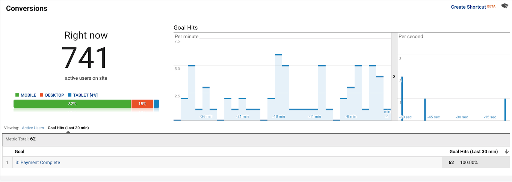
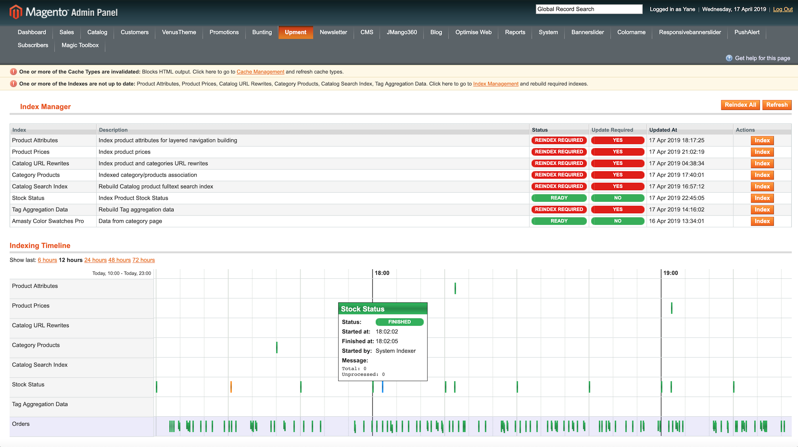

# Magento Index Manager Module

Magento 1.9.x Module for managing and analyzing indexers. Works much faster then Magento core indexer (synchron). Optimized and build for high traffic Magento stores: https://upment.com/rebelliousfashion. Optimized for Visual Merchandiser.

## Features

- Extensive logging of indexing events.
- Customisable visual display of logged events.
- Indexing job queue.
- Failed indexing jobs will be restarted.
- History Timeline
- Fast Asynchronous indexing
- Optimized for Visual Merchandiser (Scheduled indexing)

## Installation

1. Download or clone this repo and copy the app and skin folders to your Magento installation.
2. Log into your website's admin panel (if you are already logged in, you might have to log out and log back in).
3. Flush Magento Cache.
4. Go to Upment - Index Manager. You should be able to see indexing options.

## Upment Indexer Module for High Traffic Websites

The module was developed for the purpose of managing a high traffic Magento store. Management staff was able to update prices and search index in the backend without interfering with the traffic. With the core magento module and that amount of traffic that wasn't possible.

